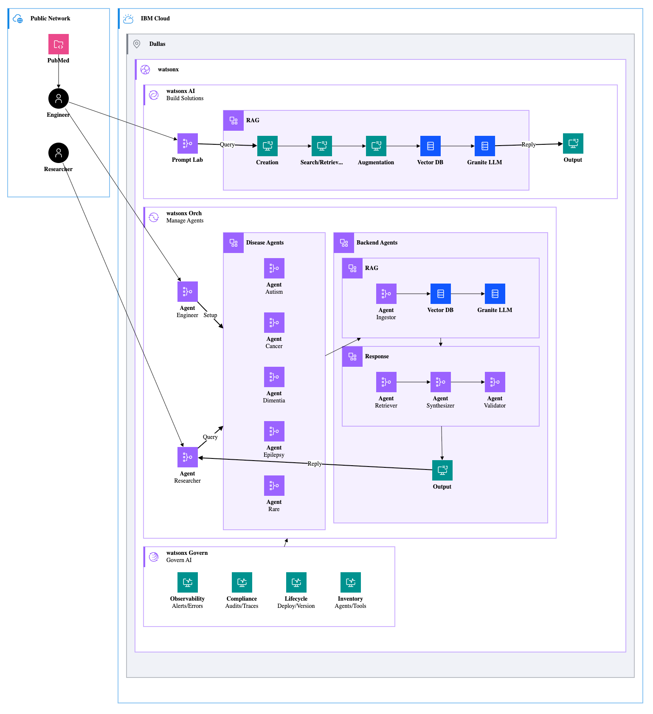

# **SynthMed Agent - IBM AI Lab Challenge: AI Medical Research Synthesis Agent**

### Problem Description

Medical researchers face a growing challenge: the volume of new clinical studies, 
systematic reviews, and scientific publications is increasing faster than teams 
can realistically read, interpret, and apply. 

Research teams often need to synthesize insights across dozens of papers to answer 
a single complex question. However, time constraints, fragmented data sources, and
dense academic language make this process slow and overwhelming. 

This results in delayed decision-making, missed insights, and barriers to translating 
research into real-world healthcare improvements.

To overcome this, we developed SynthMed, a powerful Agentic AI medical research assistant.

### Solution Description

IBM watsonx enables this solution by utilizing a sophisticated pipeline that ingests,
analyzes, and synthesizes insights from massive volumes of medical literature.

Our architecture uses watsonx Orchestrate and Retrieval-Augmented Generation (RAG) to 
enable role-based multi-agent collaboration. A query to the main agent automatically 
invokes the appropriate, specialized subagent (e.g., for a specific disease) to
provide grounded, cited answers. 

RAG retrieves relevant chunks of source material, providing the necessary context for 
foundation LLMs to generate narrative synthesis. This ensures all outputs are grounded 
in source text and are returned to the researcher showing where the response was 
obtained from (citations).

Researchers interact with the watsonx Orchestrate UI to submit complex queries, inspect
the retrieved passages, and review the agent's results.  They can also leverage the Prompt 
Lab to design and compare output across models, ensuring the selection of the most accurate 
and appropriate model for synthesis.

SynthMed is built on a specialized, modular approach, featuring a Main Agent that acts as 
the central orchestrator coordinating queries across dedicated disease-specific subagents 
for Autism, Cancer, Dementia, Epilepsy, and Rare Diseases. Medical papers are uploaded 
into the Vector Database knowledge base specific to each subagent, ensuring that queries 
are answered using the most relevant and focused literature set. 

Extensive engineering of the Main Agent's highly structured instructions was crucial to i
prevent inconsistencies, such as unnecessary clarification questions or clustered, 
hard-to-trace references. By streamlining these instructions, we guaranteed a consistent, 
verifiable output format adhering to a strict template—including an "Executive Summary," 
"Synthesis," a structured "Disease Domain" table, and a final "References" list with 
each source on a separate line. 

This entire multi-agent system is made accessible via IBM watsonx Orchestrate, which 
embeds the intelligent agents directly into our web application's chat feature to 
create a rich, interactive, and secure conversation experience. 

In a typical workflow, the researcher submits a complex query like, "What are the 
emerging biomarkers for pancreatic cancer prognosis?" The Main Agent immediately 
parses and routes the task to the correct subagent, and the system instantly 
returns a structured summary with the source link, allowing the researcher 
to validate the evidence instantly.

### Solution Diagram

References:
- [Solution Worksheet](images/synthmed_worksheet.png)
- [Diagram Source](source/synthmed.py)
- [Diagram Standard](https://www.ibm.com/design/language/infographics/technical-diagrams/design/)

---

# License

This application is licensed under the Apache License, Version 2.  Separate third-party code objects invoked by this application are licensed by their respective providers pursuant to their own separate licenses.  Contributions are subject to the [Developer Certificate of Origin, Version 1.1](https://developercertificate.org/) and the [Apache License, Version 2](https://www.apache.org/licenses/LICENSE-2.0.txt).

